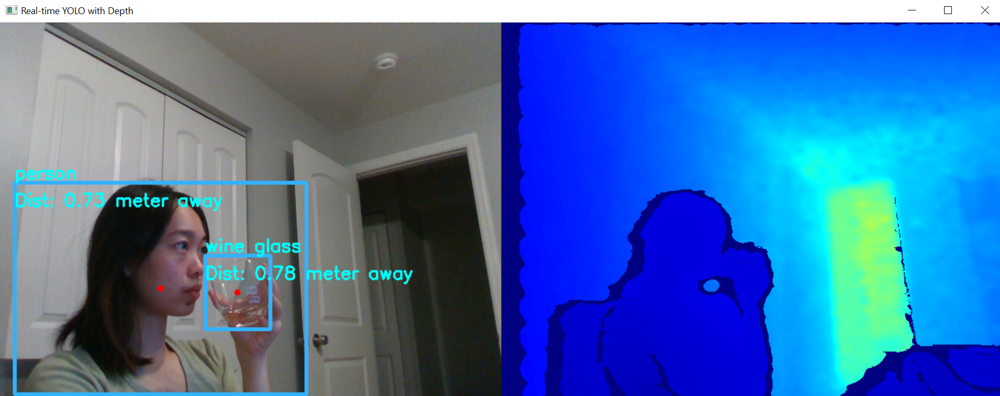
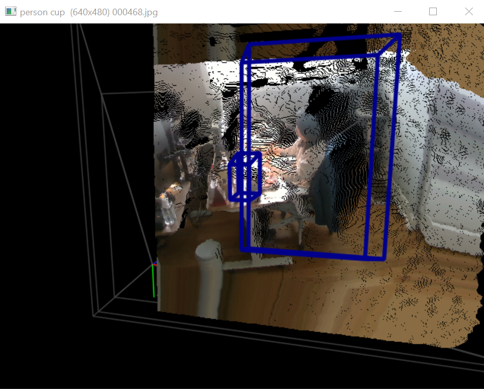

# Real-time Object Dectection with Depth
Real-time object detection and 2D/3D visualization using YOLOv3 and extract depth information via Intel RealSense D435i.

Original code of the 2D script: [dev_realsense_yolo_v3 by Tony](https://github.com/dovanhuong/dev_realsense_yolo_v3_2d#dev_realsense_yolo_v3-by-tony)


## Set Up Environment
Tested on Windows 10, with AMD® Ryzen 9 7900x & NVIDIA GeForce RTX 3090 Ti.
```
conda create --name realsense
conda activate realsense
conda install pip
pip install pyrealsense2
pip install opencv-python
```

## 2D Viewer
- Download [weight file of YOLOv3]( https://pjreddie.com/media/files/yolov3.weights) and place it in the main directory.
- Run the script from terminal `python script_2d.py`. Press `Ctrl+C` or `q` to quit.
- Visualization example:
<p float="left">
   
</p>

## 3D Viewer
- Download [weight file of YOLOv3]( https://pjreddie.com/media/files/yolov3.weights) and place it in the main directory.
- Run the script from terminal `python script_3d.py`. Press `p` to pause, `c` to switch color mode, `s` to save current screenshot, `e` to export current mesh. Press `Ctrl+C` or `q` to save last mesh and quit.
- Visualization example:
<p float="left">
   
</p>

## Troubleshoot
- wait_for_frames(): "RuntimeError: Frame didn't arrive within 5000"
  - Disable auto exposure from your Intel RealSense Viewer. You can re-enable it later if the issue does not persist.
  - or skip the first several frames as suggested [here](https://github.com/IntelRealSense/librealsense/issues/9417#issuecomment-880762163).
